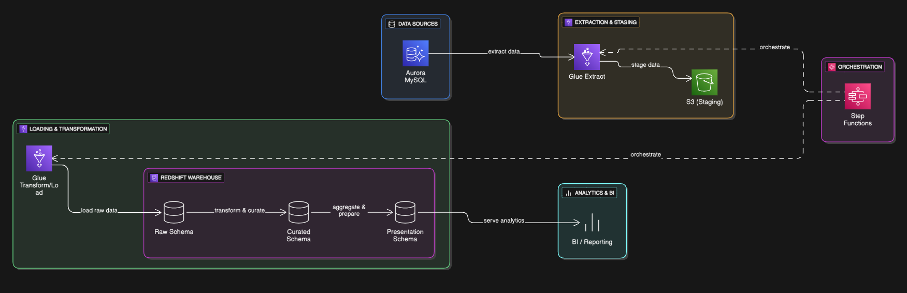
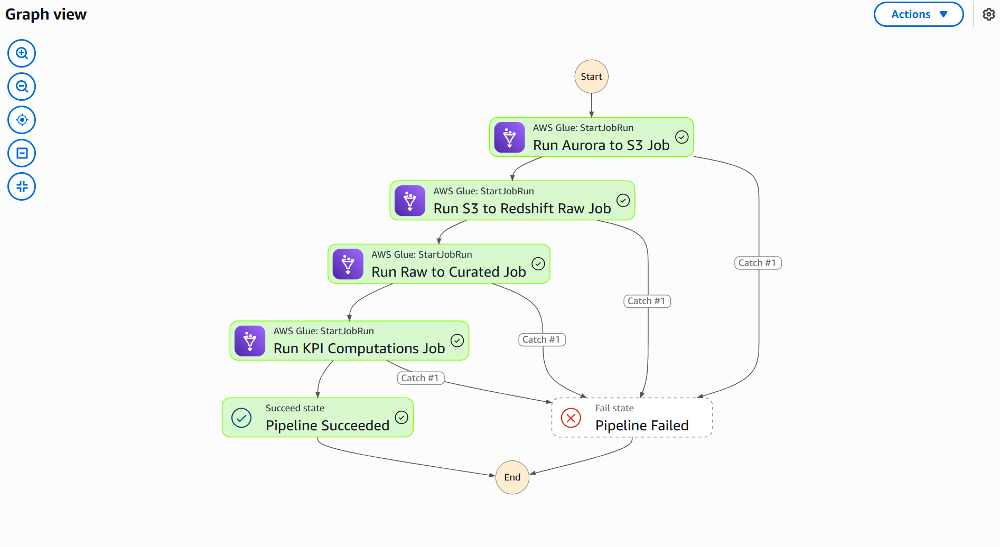

# Rental Marketplace Data Pipeline Project

## Project Title and Description

This project implements an automated, scalable batch data pipeline on AWS for a rental marketplace analytics platform. It extracts data from an AWS Aurora MySQL database, stages it in Amazon S3, and loads it into a multi-layered Amazon Redshift data warehouse. The pipeline uses AWS Glue for ETL processes and AWS Step Functions for orchestration, enabling efficient transformation and aggregation of rental and user engagement data for business intelligence.

## Features and Use Cases

- Automated extraction of rental marketplace data from Aurora MySQL.
- Data staging in Amazon S3 using Parquet format for efficient storage.
- Multi-layered data warehouse in Amazon Redshift with Raw, Curated, and Presentation schemas.
- ETL transformations using AWS Glue jobs with PySpark and Python Shell scripts.
- Orchestration of ETL workflow using AWS Step Functions for reliability and automation.
- Computation of key rental performance and user engagement KPIs.
- Secure and cost-efficient architecture leveraging AWS managed services.

## Prerequisites and Installation Instructions

- AWS Account with permissions to create and manage AWS Glue, Redshift, Aurora, S3, IAM, and Step Functions.
- AWS CLI configured or access to AWS Management Console.

## Step-by-Step Setup Guide

### 1. Set up VPC and Networking

- **Create a VPC:**  
  In the AWS Console, go to the VPC service and create a new Virtual Private Cloud (VPC). Use a CIDR block like `10.0.0.0/16` for ample IP space.
- **Create Subnets:**  
  Create at least three subnets: two private subnets (for databases and Redshift) and one public subnet (for NAT Gateway and temporary EC2/bastion hosts). Assign each subnet to a different Availability Zone for high availability.
- **Set Up Internet and NAT Gateways:**  
  Attach an Internet Gateway to the VPC. In the public subnet, deploy a NAT Gateway so that resources in private subnets (like Glue jobs or Redshift) can access the internet for updates without being exposed publicly.
- **Configure Route Tables:**  
  Associate the public subnet with a route table that routes 0.0.0.0/0 traffic to the Internet Gateway. Associate private subnets with a route table that routes 0.0.0.0/0 traffic to the NAT Gateway.
- **Create Security Groups:**  
  - Create a security group for Aurora, allowing inbound MySQL/Aurora traffic (port 3306) only from trusted sources (e.g., your EC2 loader or Glue jobs).
  - Create a security group for Redshift, allowing inbound Redshift traffic (port 5439) from trusted sources.
  - Create a security group for Glue with a self-referencing inbound rule (for Spark job communication).
  - Create a security group for EC2 bastion/loader, allowing SSH from your IP.

### 2. Launch Aurora MySQL Database

- **Create Aurora Cluster:**  
  In the RDS console, create an Aurora MySQL-compatible cluster in one of your private subnets. Choose a small instance type for development (e.g., `db.t3.small`). Set the database to be non-public.
- **Set Up Credentials:**  
  Create and securely store the admin username and password.
- **Configure Security:**  
  Attach the Aurora security group you created earlier.
- **Load Initial CSV Data:**  
  Since Aurora is in a private subnet, you cannot connect directly from your local machine. Instead:
  - **Launch a temporary EC2 instance** in the public subnet (using Amazon Linux, t2.micro is sufficient).
  - **Upload CSVs:** Use `scp` or WinSCP to transfer your CSV files to the EC2 instance.
  - **Install MySQL Client:** SSH into the EC2 instance and run `sudo yum install mysql -y` (Amazon Linux) to install the MySQL CLI.
  - **Connect to Aurora:** Use the MySQL CLI to connect to your Aurora endpoint (get this from the RDS console).
  - **Create Tables and Load Data:**  
    Create the necessary tables in Aurora using `CREATE TABLE` statements that match your CSV schemas. Use `LOAD DATA LOCAL INFILE` commands to bulk load each CSV into its respective table.
  - **Terminate EC2 Instance:**  
    Once data is loaded, terminate the EC2 instance to avoid unnecessary charges.

### 3. Create S3 Bucket

- **Create Bucket:**  
  In the S3 console, create a new bucket with a unique name (e.g., `rental-marketplace-datalake--`).
- **Enable Versioning:**  
  Turn on versioning to protect against accidental overwrites or deletions.
- **Block Public Access:**  
  Ensure all public access is blocked for security.
- **Organize Data:**  
  Create folders (prefixes) such as `/staging/`, `/logs/`, `/scripts/` for organization.

### 4. Provision Redshift Cluster

- **Create Cluster:**  
  In the Redshift console, create a provisioned cluster (e.g., `dc2.large` for dev/testing) in a private subnet.
- **Configure Security:**  
  Attach the Redshift security group.
- **Set Up IAM Role:**  
  Create or attach an IAM role that allows Redshift to access your S3 bucket (for `COPY` commands).
- **Subnet Group:**  
  Create a Redshift subnet group including all private subnets.
- **Store Credentials:**  
  Set and securely store the admin user and password.

### 5. Create IAM Roles

- **Glue Role:**  
  Create an IAM role for Glue (`glue-rental-marketplace-role`) with policies:
    - `AWSGlueServiceRole`
    - `AmazonS3FullAccess` (or restricted to your bucket)
    - `AmazonRDSReadOnlyAccess`
- **Redshift Role:**  
  Create a role for Redshift with S3 read permissions.
- **Step Functions Role:**  
  Create a role for Step Functions with permissions to start Glue jobs and pass the Glue role.

### 6. Create Glue Connections

- **Aurora Connection:**  
  In Glue, create a JDBC connection to your Aurora cluster, specifying the VPC, subnet, and security group.
- **Redshift Connection:**  
  Create a JDBC connection to your Redshift cluster.

### 7. Develop Glue ETL Jobs

- **Job 1: Aurora to S3 Raw Layer**  
  Use Glue Studio to create a Spark job that extracts data from Aurora (via JDBC connection) and writes it as Parquet files to the S3 staging bucket, one folder per table.
- **Job 2: S3 Raw to Redshift Raw Layer**  
  Create a Glue Python Shell job that uses the Redshift Data API to run `COPY` commands, loading Parquet files from S3 into the raw tables in Redshift.
- **Job 3: Raw to Curated Transformation**  
  Create a Glue Spark job or Python Shell job to read raw tables, apply data cleaning and transformations (using PySpark or SQL), and write results into curated tables in Redshift.
- **Job 4: KPI Computations**  
  Create a Glue Spark job that computes KPI metrics from the curated tables and writes results into the presentation layer tables in Redshift.

### 8. Create Redshift Schemas and Tables

- **Define Schemas:**  
  In Redshift Query Editor, create `raw`, `curated`, and `presentation` schemas.
- **Create Tables:**  
  For each schema, create tables matching your data model and transformation outputs (use `CREATE TABLE` statements).

### 9. Build Step Functions Workflow

- **Create State Machine:**  
  In AWS Step Functions, create a new state machine using the Workflow Studio or JSON editor.
- **Define Steps:**  
  Add tasks to sequentially trigger each Glue job using the `.sync` integration, so each step waits for the previous job to finish.
- **Add Error Handling:**  
  Use `Catch` blocks to handle failures and send notifications or halt the pipeline if any step fails.
- **Assign IAM Role:**  
  Attach the Step Functions role you created earlier.

---

### Tips and Common Pitfalls

- **Subnet and Security Group Issues:**  
  If Glue jobs or Redshift cannot connect to Aurora or S3, double-check that all resources are in the correct subnets and security groups allow the necessary inbound/outbound traffic.
- **IAM Permissions:**  
  If a Glue job fails to start or cannot access S3, verify that the IAM roles have the correct permissions and are properly attached.
- **Aurora Data Loading:**  
  Always terminate your EC2 loader instance after use to avoid charges. Double-check CSV formats and table schemas before loading.
- **Step Functions Failures:**  
  If the pipeline fails, check the execution history in Step Functions for error details, and review Glue job logs for root causes.
- **Resource Limits:**  
  If you get errors about insufficient IPs or subnets, ensure you have at least three private subnets in different Availability Zones for Redshift (if using serverless or multi-AZ clusters).

## How to Run the Project

- Trigger the AWS Step Functions state machine to start the ETL pipeline.
- Monitor job execution and logs via AWS Glue and Step Functions consoles.
- Query the Redshift presentation layer for KPIs and analytics.

## Troubleshooting Guide

- **Glue Job Fails to Start:** Check IAM roles and security group rules allowing Glue to access Aurora and Redshift.
- **Connectivity Issues:** Verify VPC, subnet, and security group configurations.
- **Data Load Errors:** Confirm CSV data formats and table schemas match.
- **Step Functions Failures:** Review error messages in Step Functions console; ensure Glue job names are correct.
- **Insufficient IP Addresses:** Add additional private subnets in different Availability Zones.